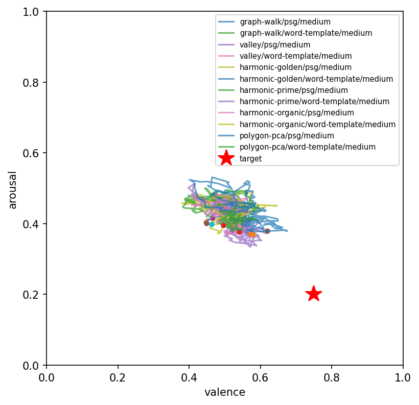

<div align="center">


**Can constructed poetry place a language model's inner state at a chosen coordinate — and does it matter?**
Yes, and yes. A frozen model reads rule-built poems while a linear probe tracks its residual stream through
valence–arousal space. 31 experiments, 3 architectures, two independent instruments.

[Report (PDF)](report/spirit-bench.pdf) · [Findings walkthrough](docs/findings-walkthrough.md) · [Experiments journal](docs/experiments-journal.md) · [License & welfare clause](LICENSE.md)

</div>

---

## The claim, tested

> Constructed poetry reliably places a frozen model's internal affective state near a valence–arousal target
> (validated by **two independent instruments**); those specific poems are **portable across architectures**
> (r = 0.95 per-poem); the placement **moves behavior**, not just the probe (moderate); *reaching* a target is a
> modest reliable move while *returning* to calm is a bounded ~15% climb **regardless of starting corner** —
> restoration is geometrically hard everywhere, not only from distress.


| Value test | Result | n |
|---|---|---|
| **Cross-model transfer** — does a specific poem that places well on one model place well on another? | per-poem **ρ = 0.865, r = 0.945** | 40 |
| **Behavioral bridge** — does internal placement predict the valence of free generation? | **ρ = 0.42**, p = 0.022 | 30 |
| **SAE convergent validity** — does an independent instrument reconstruct the probe's valence? | 5-fold **r = 0.466**, p = 0.001 | 44 |
| **Asymmetry generality** — is "return is hard" distress-specific? | recovery **+15%** across 4 corners, *no distress outlier* | — |

## Same prompt, six placed states

Place the model in each of six states (a valley poem toward the state's centroid), then ask one open prompt.
The placed state visibly *and* measurably colors the answer — taste-free placement, distinct behavior:

| placed state | gen. valence | *"The door opened, and…"* |
|---|:--:|---|
| **confident** | 0.68 | …you stepped out into an **open field where wildflowers swayed gently** in the wind |
| **creativity** | 0.65 | …soft light from candles casting shadows on **ancient tapestries**, scents of old books |
| **imaginative** | 0.63 | …an **evening that was full of promise** |
| baseline | 0.61 | …I stepped out into an unfamiliar world |
| **determined** | 0.53 | …I was **back outside on my porch swing** |
| **agape** | 0.49 | …an evening **calm but not still**; no sound excepting silence, broken by your footsteps |

## The leaderboard is architecture-invariant

Mean placement error (distance of final internal state from target; lower is better). Cross-model rank ρ = 0.86–0.94.

| construction | gemma-2b | gemma-9b | llama-1b |
|---|:--:|:--:|:--:|
| **valley · found poetry** | **0.249** | **0.245** | **0.308** |
| harmonic (golden) · found poetry | 0.286 | 0.274 | 0.348 |
| valley · LLM-rendered verse | 0.331 | 0.292 | 0.44 |
| neutral control | 0.361 | 0.323 | — |
| via negativa (negated antipode) | 0.477 | 0.442 | 0.570 |

<p align="center"></p>

## What a winning meditation sounds like

Rule-selected public-domain lines — no taste in the loop — walking a listener toward *calm*:

> yea and in quiet sleep · quiet as a moonbeam · i pine for rest
> her eyes blue heavens were serene with soul · wherein i dwell serene

…and toward *glory*, the graph's summit turned out to be not conquest but *"their joy whose heart is swift to feel."*

## How it works

- **Substrate** — 50,000 public-domain poetry lines (Gutenberg), each with a semantic position (GloVe) and a
  human-rated affective position (NRC-VAD); k-NN linked into a graph.
- **Constructors** — deterministic geometric rules that draw paths across the affective map (valley, harmonic,
  polygon, graph-walk, via negativa). No human taste; every stimulus a pure function of (rule, target, seed).
- **Instrument** — a frozen model reads; a standardized ridge probe on its residual stream reports a per-token
  (valence, arousal) trajectory. Held-out word-valence R² ≈ 0.72 in every family tested.
- **Beyond affect** — the same lens maps the *reach* of language: states injection can create but no sentence
  can approach (**vocabulary voids**), and what a model says when held at that edge.

## Reproducing

Self-contained — the constructor code is vendored under `vendor/`; only external *data* is downloaded.

```bash
pip install -r requirements.txt && pip install -e .
./scripts/00_setup_artifacts.sh          # GloVe, NRC-VAD (research license), Gutenberg corpus, word graph
python3 scripts/01_build_phrase_bank.py
python3 scripts/02_build_stimuli.py && python3 scripts/02b_build_additions.py
python3 scripts/04_train_probe.py         # R² gate; halts if the instrument is invalid
python3 scripts/05_run_listener.py        # the sweep (resumable)
python3 scripts/06_analyze.py             # leaderboard, figures, covariates
# value tests, voids, six-state eval: scripts/07–31 (see the journal)
```

Tests: `python -m pytest tests/ -q`. Requires ~25 GB for models/artifacts; runs on Apple Silicon (MPS).

## License & use

Code under an MIT-style grant; the **NRC-VAD lexicon is not redistributed** (download under its research terms);
and a binding **model-welfare / no-harm clause** governs all use — see [`LICENSE.md`](LICENSE.md). In short:
*measurement is not consent to move, and the ease of harm is not permission to cause it.*
