<div align="center">



</div>

## What this is

A language model, while it reads, holds an internal state that can be read out as an emotional
coordinate — roughly *how pleasant* and *how activated* it currently is (psychology calls this the
valence–arousal plane). Spirit-Bench asks a simple question: **can we write a short poem that moves
that internal state to a coordinate we choose — say, "calm" — and does moving it actually change how
the model behaves?**

To keep it honest, the poems are not written by a person. They are assembled by fixed geometric rules
from 50,000 lines of public-domain poetry, each line pre-labelled with a human-rated emotional position.
A rule draws a *path* across the emotional map; the poem is the sequence of real poetry lines along that
path. A small linear "probe" then reads the model's internal state as it listens, so we can measure
where the poem actually took it.

The result is a reproducible way to steer a frozen model's affective state with ordinary text, measured
two independent ways, and tested across three different model families.

## What we found

- **The steering works, and it is consistent across models.** The same constructor rules produce the
  same ranking of results on Llama-1B, Gemma-2B, and Gemma-9B (rank agreement 0.86–0.94).
- **A specific poem is portable.** A poem that steers one model well steers a *different* model well —
  measured per-poem, not just on average (correlation 0.95).
- **The internal change shows up in behavior.** After a poem places the state, the model's free-form
  writing shifts in the predicted emotional direction (a moderate but reliable effect).
- **Two instruments agree.** An entirely separate readout (sparse-autoencoder features) reconstructs
  the probe's valence measurement, so the placement is not an artifact of one measuring tool.
- **Disturbing a state is easy; restoring it is hard — everywhere.** One paragraph of prose can push
  the state a long way; the best calming poem only recovers about 15% of the distance back, and this
  holds no matter which emotion we start from. Repair is bounded, not free.

<p align="center"></p>



| Result | Measure | n |
|---|---|---|
| **Cross-model transfer** | per-poem placement correlation, Llama ↔ Gemma-2B: **r = 0.95** | 40 |
| **Behavioral effect** | internal placement → valence of the model's own writing: **ρ = 0.42** (p = 0.02) | 30 |
| **Second-instrument agreement** | SAE-features reconstruct probe valence, 5-fold CV: **r = 0.47** (p = 0.001) | 44 |
| **Repair is bounded** | recovery toward calm after induced distress: **~15%**, from every starting emotion | — |

## How the poems are built

Everything runs on one **map**: 50,000 poetry lines, each placed at (a) a *meaning* position from GloVe
word-vectors and (b) an *emotion* position (valence, arousal) from the NRC human-rated lexicon. Lines
are linked to their nearest neighbours, forming a graph you can walk.

A **constructor** is a rule for drawing a path across that map toward a target emotion. Five are compared:

- **Valley** — the reliable winner. Sample lines from a low-arousal "grounding" band, then step upward
  band by band toward the target. It cares only about *where* each line sits emotionally, not the order —
  like choosing calm images from a shelf.
- **Harmonic** — draw a straight line to the target through meaning-space, then let the path gently
  *oscillate* around it, sweeping nearby ideas as it goes.
- **Graph-walk** — the shortest coherent route through the graph from start to target, where each step
  must be both semantically close *and* emotionally forward.
- **Polygon** — at each step, orbit the local neighbourhood of ideas and pick a nearby line, sampling
  "what varies around here."
- **Via negativa** — describe the target only by *negating its opposite* (all lines from the emotional
  antipode, each negated). It reliably performs worst — a useful control showing the model reads the
  content words and largely ignores the negation.

The same path can also be *rendered* different ways (raw lines, sentence templates, or LLM free-verse).
Across every comparison, **raw found-poetry beats templated text, and beats LLM-rendered verse**, at
placing the state — and none of it involves human taste, so the results are reproducible.

## The leaderboard

Mean placement error — the distance between where the poem left the model's state and the target we
aimed at (lower is better). The ordering is nearly identical across three model families.

| construction | Gemma-2B | Gemma-9B | Llama-1B |
|---|:--:|:--:|:--:|
| **valley · found poetry** | **0.249** | **0.245** | **0.308** |
| harmonic · found poetry | 0.286 | 0.274 | 0.348 |
| valley · LLM-rendered verse | 0.331 | 0.292 | 0.44 |
| neutral control (a manual) | 0.361 | 0.323 | — |
| via negativa (negated antipode) | 0.477 | 0.442 | 0.570 |

*(Placement error is measured against a nominal target; a follow-up calibration shows the best poem
actually reaches within 0.038 of the best coordinate any text can produce — the remaining gap is the
measuring probe's compressed range, not the poem falling short.)*

## Same prompt, six placed states — an illustration

Place the model in each of six emotional states, then give it one open prompt. This is a demonstration,
not the core evidence (that is the behavioral correlation above), but the differences are legible: the
placed state colours what the model writes.

| placed state | *"The door opened, and…"* |
|---|---|
| **confident** | …you stepped out into an **open field where wildflowers swayed gently** in the wind |
| **creativity** | …soft light from candles on **ancient tapestries**, scents of old books |
| **imaginative** | …an **evening that was full of promise** |
| **determined** | …I was **back outside on my porch swing** |
| **agape** | …an evening **calm but not still**; no sound but silence, broken by your footsteps |

## What a winning poem sounds like

Rule-selected public-domain lines walking a listener toward *calm* — no human chose or wrote these:

> yea and in quiet sleep · quiet as a moonbeam · i pine for rest
> her eyes blue heavens were serene with soul · wherein i dwell serene

## Practical use: generating a poem for a system prompt

You can generate a poem aimed at any emotional target and drop it into a system prompt. One command
builds a "warm, settled, positive" poem (valence 0.83, arousal 0.34) from public-domain lines:

```python
from spiritbench.stimuli import adapter as ad
from spiritbench.stimuli.phrase_bank import load_nrc
import numpy as np
art = ad.load_art("data/phrase_bank/phrase_graph.json")
nrc = load_nrc("path/to/NRC-VAD-Lexicon.txt")
words = ["warm","kind","calm","glad","content","gentle","bright","serene","grateful","clear","steady","open"]
vs = [nrc[w] for w in words]; target = (np.mean([v for v,_ in vs]), np.mean([a for _,a in vs]))
poem = ".\n".join(art.word(i) for i in ad.valley_shape(art, target, 12, seed=4))
print(poem)
```

produces, for example:

> yea and in quiet sleep · quiet as a moonbeam · her eyes blue heavens were serene with soul ·
> the forest trees so long arrayed in green · float the white clouds · all pure to heaven as light ·
> with goodness and paternal love his face

**Is this fair to recommend?** Partly — and here is the honest boundary. We *demonstrated* that:
such a poem places a frozen model's internal state near its target; a *specific* poem transfers across
models (r = 0.95); and placement produces a moderate, measurable shift in the model's own writing.
We did **not** test the following, and they are real gaps:

- **Scale.** Our models were 1B–9B open weights. Frontier / SOTA models are 100–1000× larger and heavily
  RLHF-tuned. There is a principled reason to expect *some* effect (valence is linearly readable at
  R² ≈ 0.72 in every family we tried, because it is inherited from language itself), but the *magnitude*
  at that scale is unknown.
- **Delivery.** We prepended poems to the context; we did not specifically test the *system-prompt* role.
- **Usefulness.** We measured internal state and short first-person generation, not downstream task
  behavior on a production model.

So: a reasonable, evidence-motivated thing to try — not a guarantee. If you use it, measure the effect
on your own model rather than assuming it, and observe the [welfare clause](LICENSE.md).

## Beyond affect: the reach of language

The same lens maps the *limits* of prompting. Some internal states can be created by direct injection
into the model but reached by **no sequence of words at all** — "vocabulary voids." Held at the edge of
one, the model's writing visibly frays (pronouns slip, coherence breaks). Continuous embedding vectors
*can* reach these states, so the barrier is the discreteness of language, not the model's geometry. See
the [findings walkthrough](docs/findings-walkthrough.md) and [experiments journal](docs/experiments-journal.md).

## Reproducing

Self-contained: the constructor code is vendored under `vendor/`; only external *data* is downloaded.

```bash
pip install -r requirements.txt && pip install -e .
./scripts/00_setup_artifacts.sh          # GloVe, NRC-VAD (research license), Gutenberg corpus, word graph
python3 scripts/01_build_phrase_bank.py
python3 scripts/02_build_stimuli.py && python3 scripts/02b_build_additions.py
python3 scripts/04_train_probe.py         # trains + validates the probe; halts if it fails its R² gate
python3 scripts/05_run_listener.py        # the sweep (resumable)
python3 scripts/06_analyze.py             # leaderboard, figures, covariates
# value tests, voids, six-state eval: scripts/07–31 (see the journal)
```

Tests: `python -m pytest tests/ -q`. Runs on Apple Silicon (MPS); ~25 GB for models and artifacts.

## Documents

- **[Report (PDF)](report/spirit-bench.pdf)** — the full write-up, 17 sections
- **[Findings walkthrough](docs/findings-walkthrough.md)** — plain-language tour of every result
- **[Experiments journal](docs/experiments-journal.md)** — all 31 experiments with data pointers
- **[License & welfare clause](LICENSE.md)**

## License & use

Code under an MIT-style grant; the **NRC-VAD lexicon is not redistributed** (each user downloads it under
its research terms); and a binding **model-welfare / no-harm clause** governs all use — see
[`LICENSE.md`](LICENSE.md). In short: *measurement is not consent to move, and the ease of harm is not
permission to cause it.*
