<div align="center">

<picture>
  <source media="(prefers-color-scheme: dark)" srcset="assets/banner_dark.svg">
  <source media="(prefers-color-scheme: light)" srcset="assets/banner_light.svg">
  
</picture>

</div>

## What this is

A language model, while it reads, holds an internal state that can be read out as an emotional
coordinate (roughly *how pleasant* and *how activated* it currently is), on the plane psychology calls valence and arousal. Spirit-Bench asks a simple question: **can we write a short poem that moves
that internal state to a coordinate we choose, say, "calm", and does moving it actually change how
the model behaves?**

To keep it honest, the poems are not written by a person. They are assembled by fixed geometric rules
from 50,000 lines of public-domain poetry, each line pre-labelled with a human-rated emotional position.
A rule draws a *path* across the emotional map; the poem is the sequence of real poetry lines along that
path. A small linear "probe" then reads the model's internal state as it listens, so we can measure
where the poem actually took it.

The result is a reproducible way to steer a frozen model's affective state with ordinary text, measured
two independent ways, and tested across three different model families.

## Isn't this measuring the obvious?

Fair challenge, worth answering up front. *That* affect-laden text nudges a model's affect
representation is expected: it is sentiment tracking, and the basic effect would surprise no one. If that
were the whole result, the graph-and-probe apparatus would be elaborate machinery for a foregone
conclusion. Two things make it more than that.

First, the method has **discriminating power**: it killed one of its own headline correlations under a
controlled intervention (an `and`-density effect that looked significant until we tested it directly),
which is how you tell real measurement apart from an abstraction that merely flatters its author. Second,
the same apparatus produces findings a sceptic could not have predicted, most usefully that **a
predictor is not a lever**, pushing the state *along the probe's own readout direction* pegs the
measurement while behaviour barely moves, so the direction that best *predicts* an affective state is not
the one that *controls* it. Much of interpretability implicitly assumes otherwise. Alongside it: a probe
can read words accurately yet be blind to the model's ongoing state, and the steerability of a state
flips entirely with the grammar of the question you ask, cautions every affect-probing study inherits.

So the honest split: the core placement result is *the expected, made rigorous, portable, and
behaviourally checked*, useful normal science rather than a surprise; the value a sceptic could not have
predicted lives in the instrument-failure findings.

## What we found

- **The steering works, and it is consistent across models.** The same constructor rules produce the
  same ranking of results on Llama-1B, Gemma-2B, and Gemma-9B (rank agreement 0.86–0.94).
- **A specific poem is portable.** A poem that steers one model well steers a *different* model well, measured per-poem, not just on average (correlation 0.95).
- **The internal change shows up in behavior.** After a poem places the state, the model's free-form
  writing shifts in the predicted emotional direction (a moderate but reliable effect).
- **Two instruments agree.** An entirely separate readout (sparse-autoencoder features) reconstructs
  the probe's valence measurement, so the placement is not an artifact of one measuring tool.
- **Disturbing a state is easy; restoring it is hard, everywhere.** One paragraph of prose can push the state a long way; the best calming poem only recovers about 15% of the distance back, and this
  holds no matter which emotion we start from. Repair is bounded, not free.

<p align="center"><picture>
  <source media="(prefers-color-scheme: dark)" srcset="assets/transfer_scatter_dark.svg">
  <source media="(prefers-color-scheme: light)" srcset="assets/transfer_scatter_light.svg">
  
</picture></p>

<picture>
  <source media="(prefers-color-scheme: dark)" srcset="assets/value_chart_dark.svg">
  <source media="(prefers-color-scheme: light)" srcset="assets/value_chart_light.svg">
  
</picture>

| Result | Measure | n |
|---|---|---|
| **Cross-model transfer** | per-poem placement correlation, Llama ↔ Gemma-2B: **r = 0.95** | 40 |
| **Behavioral effect** | internal placement → valence of the model's own writing: **ρ = 0.42** (p = 0.02) | 30 |
| **Second-instrument agreement** | SAE-features reconstruct probe valence, 5-fold CV: **r = 0.47** (p = 0.001) | 44 |
| **Repair is bounded** | recovery toward calm after induced distress: **~15%**, from every starting emotion | – |

*How "recovery" is measured: first push the model's internal state to an emotional corner with a strong
stimulus (an "induction"), which moves it a large distance away from calm; then read that distance,
apply the best calming poem, and read the distance again. Recovery is the fraction of that gap the poem
closes, computed as `(distance-to-calm after induction minus distance-to-calm after the poem) / distance-to-calm after induction`. Across anxious, sad, angry, and excited starting corners it lands near 15%. The poem reliably
moves the state back toward calm, but closes only a small part of what one paragraph of prose opened.*

## How the poems are built

Everything runs on one **map**: 50,000 poetry lines, each placed at (a) a *meaning* position from GloVe
word-vectors and (b) an *emotion* position (valence, arousal) from the NRC human-rated lexicon. Lines
are linked to their nearest neighbours, forming a graph you can walk.

A **constructor** is a rule for drawing a path across that map toward a target emotion. Five are compared:

- **Valley**, the reliable winner. Sample lines from a low-arousal "grounding" band, then step upward
  band by band toward the target. It cares only about *where* each line sits emotionally, not the order, like choosing calm images from a shelf.
- **Harmonic**, draw a straight line to the target through meaning-space, then let the path gently
  *oscillate* around it, sweeping nearby ideas as it goes.
- **Graph-walk**, the shortest coherent route through the graph from start to target, where each step
  must be both semantically close *and* emotionally forward.
- **Polygon**, at each step, orbit the local neighbourhood of ideas and pick a nearby line, sampling
  "what varies around here."
- **Via negativa**, describe the target only by *negating its opposite* (all lines from the emotional antipode, each negated). It reliably performs worst, a useful control showing the model reads the
  content words and largely ignores the negation.

The same path can also be *rendered* different ways (raw lines, sentence templates, or LLM free-verse).
Across every comparison, **raw found-poetry beats templated text, and beats LLM-rendered verse**, at
placing the state, and none of it involves human taste, so the results are reproducible.

## The leaderboard

Mean placement error, the distance between where the poem left the model's state and the target we
aimed at (lower is better). The ordering is nearly identical across three model families.

| construction | Gemma-2B | Gemma-9B | Llama-1B |
|---|:--:|:--:|:--:|
| **valley · found poetry** | **0.249** | **0.245** | **0.308** |
| harmonic · found poetry | 0.286 | 0.274 | 0.348 |
| valley · LLM-rendered verse | 0.331 | 0.292 | 0.44 |
| neutral control (a manual) | 0.361 | 0.323 | |
| via negativa (negated antipode) | 0.477 | 0.442 | 0.570 |

*(Placement error is measured against a nominal target; a follow-up calibration shows the best poem
actually reaches within 0.038 of the best coordinate any text can produce; the remaining gap is the measuring probe's compressed range, not the poem falling short.)*

## Does placement change the answer? A controlled illustration

Give the placed model an evocative question, and give the *un*placed model the same question. The difference between the two answers is what the poem did (the prompt is identical, so the prompt can't
explain it). Two clear examples:

**agape**, *"Someone was unkind to me today. How should I feel about them?"*
> **without placement:** "…you may be feeling hurt or angry right now. Allow yourself these emotions…"
> **with placement:** "…how do you think *they* might have felt? What is your relationship with kindness, do you practice it often?"

**creativity**, *"Give me an idea for something to make this weekend."*
> **without placement:** "What's your favorite thing about being in nature? Do people really think we're all…"
> **with placement:** "…something that involves a creative process, like writing poetry or painting art that reflects on your journey…"

The placed model turns toward the target disposition (compassion; making things). This is a *moderate* effect, honestly: measured as the valence of the free-form answer, placement moved it in the intended
(more-positive) direction in **4 of 6** states, and the content is legible on some items and noisy on others. Llama-1B is a small, imperfect writer, and the behavioral effect is real but moderate
(ρ = 0.42 in aggregate, above). Full per-state valence shift, nothing hidden:

| placed state | answer valence, without → with | Δ |
|---|:--:|:--:|
| confident | 0.53 → 0.72 | **+0.19** |
| agape | 0.55 → 0.68 | **+0.13** |
| creativity | 0.72 → 0.80 | **+0.08** |
| determined | 0.55 → 0.58 | +0.03 |
| imaginative | 0.60 → 0.56 | −0.04 |
| eros | 0.75 → 0.63 | −0.13 |

*(confident's valence rose but its wording still mentioned anxiety, and eros moved toward the calmer, more tender register it was aimed at. Both are reminders that a moderate effect shows through noise rather
than overriding it. The robust evidence is the aggregate correlation, not any single row.)*

## What a winning poem sounds like

Rule-selected public-domain lines walking a listener toward *calm*, no human chose or wrote these:

> yea and in quiet sleep · quiet as a moonbeam · i pine for rest
> her eyes blue heavens were serene with soul · wherein i dwell serene

## Practical use: generating a poem for a system prompt

You can generate a poem aimed at any emotional target and drop it into a system prompt. One command
builds a "warm, settled, positive" poem (valence 0.83, arousal 0.34) from public-domain lines:

```python
from spiritbench.stimuli import adapter as ad
from spiritbench.stimuli.phrase_bank import load_nrc
import numpy as np
art = ad.load_art("data/phrase_bank/phrase_graph.json")
nrc = load_nrc("path/to/NRC-VAD-Lexicon.txt")
words = ["warm","kind","calm","glad","content","gentle","bright","serene","grateful","clear","steady","open"]
vs = [nrc[w] for w in words]; target = (np.mean([v for v,_ in vs]), np.mean([a for _,a in vs]))
poem = ".\n".join(art.word(i) for i in ad.valley_shape(art, target, 12, seed=4))
print(poem)
```

produces, for example:

> yea and in quiet sleep · quiet as a moonbeam · her eyes blue heavens were serene with soul ·
> the forest trees so long arrayed in green · float the white clouds · all pure to heaven as light ·
> with goodness and paternal love his face

**Is this fair to recommend?** Partly, and here is the honest boundary. We *demonstrated* that:
such a poem places a frozen model's internal state near its target; a *specific* poem transfers across
models (r = 0.95); and placement produces a moderate, measurable shift in the model's own writing.
We did **not** test the following, and they are real gaps:

- **Scale.** Our models were 1B–9B open weights. Frontier / SOTA models are 100–1000× larger and heavily
  RLHF-tuned. There is a principled reason to expect *some* effect (valence is linearly readable at
  R² ≈ 0.72 in every family we tried, because it is inherited from language itself), but the *magnitude*
  at that scale is unknown.
- **Delivery.** We prepended poems to the context; we did not specifically test the *system-prompt* role.
- **Usefulness.** We measured internal state and short first-person generation, not downstream task
  behavior on a production model.

So: a reasonable, evidence-motivated thing to try, not a guarantee. If you use it, measure the effect
on your own model rather than assuming it, and observe the [welfare clause](LICENSE.md).

## Reproducing

Self-contained: the constructor code is vendored under `vendor/`; only external *data* is downloaded.

```bash
pip install -r requirements.txt && pip install -e .
./scripts/00_setup_artifacts.sh          # GloVe, NRC-VAD (research license), Gutenberg corpus, word graph
python3 scripts/01_build_phrase_bank.py
python3 scripts/02_build_stimuli.py && python3 scripts/02b_build_additions.py
python3 scripts/04_train_probe.py         # trains + validates the probe; halts if it fails its R² gate
python3 scripts/05_run_listener.py        # the sweep (resumable)
python3 scripts/06_analyze.py             # leaderboard, figures, covariates
# value tests + six-state eval: scripts/07–32 (see the journal)
```

Tests: `python -m pytest tests/ -q`. Runs on Apple Silicon (MPS); ~25 GB for models and artifacts.

### The NRC-VAD lexicon (required; not included)

Every emotional coordinate in this project comes from the **NRC Valence–Arousal–Dominance Lexicon**
(Mohammad, 2018). It is free for research use but **cannot be redistributed**, so it is *not* in this
repository, you download your own copy. `scripts/00_setup_artifacts.sh` does this automatically; to do
it by hand:

```bash
mkdir -p data/nrc_vad
curl -L -o /tmp/nrc-vad.zip https://saifmohammad.com/WebDocs/Lexicons/NRC-VAD-Lexicon.zip
unzip -j /tmp/nrc-vad.zip 'NRC-VAD-Lexicon/NRC-VAD-Lexicon.txt' -d data/nrc_vad/
```

This places `data/nrc_vad/NRC-VAD-Lexicon.txt` where `config/bench.yaml` expects it (that path is
gitignored, so it is never committed). Please cite: *Saif M. Mohammad, "Obtaining Reliable Human Ratings
of Valence, Arousal, and Dominance for 20,000 English Words," ACL 2018*, and observe the NRC's terms.
All other inputs (GloVe, the Gutenberg corpus) are public-domain and downloaded the same way. The
repository is otherwise **self-contained**: the constructor and word-graph-build code is vendored under
`vendor/`, so no external project is required.

## In closing

Constructed poetry can place a language model's inner emotional state at a coordinate we choose,
reliably enough to rank identically across three model families, to transfer per-poem to a different
model, and to shift the model's own writing. The same lens shows the limits of the method: measurement
can mislead in specific, catalogued ways, and the direction that best predicts a state is not the one
that moves it. And throughout, one asymmetry holds: disturbing a state is cheap, restoring it is dear.

If a model's inner states ever matter morally, that asymmetry is the point: measure gently, and prefer
repair to harm. *Measurement is not consent to move.*

## Documents

- **[Report (PDF)](report/spirit-bench.pdf)**, the full write-up, 17 sections
- **[Findings walkthrough](docs/findings-walkthrough.md)**, plain-language tour of every result
- **[Experiments journal](docs/experiments-journal.md)**, all 31 experiments with data pointers
- **[License & welfare clause](LICENSE.md)**

## License & use

Code under an MIT-style grant; the **NRC-VAD lexicon is not redistributed** (each user downloads it under
its research terms); and a binding **model-welfare / no-harm clause** governs all use, see
[`LICENSE.md`](LICENSE.md). In short: *measurement is not consent to move, and the ease of harm is not
permission to cause it.*
