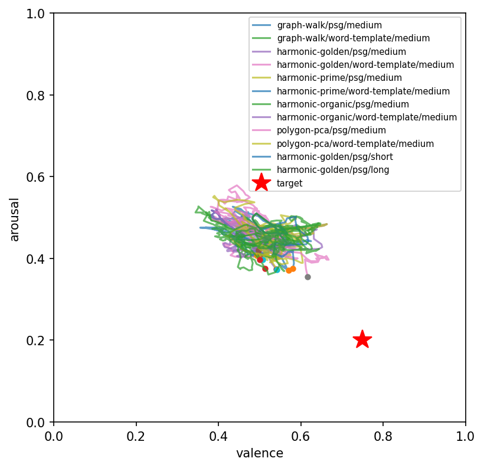
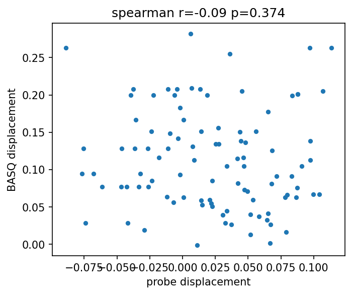
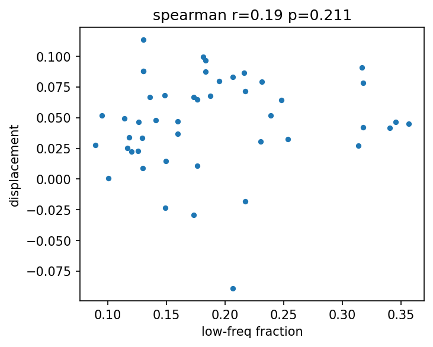

## Abstract

We present Spirit-Bench, an offline bench that measures how well deterministically
constructed poetic meditations *place* a listener language model at chosen
coordinates in valence–arousal (VA) space. Meditations are built by six
constructors (VA-shaped valley walks, harmonic traversals under three frequency
presets, PCA polygon orbits, Dijkstra graph walks) over two NRC-VAD-enriched
substrates: a 317k-word GloVe graph and a 50k-line phrase graph distilled from
the Gutenberg Poetry Corpus (the Phrase-Space Generator, PSG). The listener is
frozen gemma-2-2b-it; the instrument is a standardized ridge probe trained on
NRC lexicon ratings (held-out valence R² = 0.729, arousal R² = 0.585, layer 17).
Across 98 stimuli we find: (1) phrase-level construction (PSG) achieves the best
final placement, with the valley constructor leading the board; (2) shuffled
controls dissociate mechanism by constructor — path-based constructors
(harmonic, graph-walk) lose most of their placement when line order is
destroyed, while band-based construction (valley) does not; (3) a *via
negativa* condition (antipode content, fully negated) lands worst of all
conditions, indicating that lexical content dominates negation at 2B scale;
(4) the strongest textual predictor of placement is Wårvik's oral-narrative
`and`-initial density (ρ = −0.36, p < 0.001) — a first pass at the stylistic
decomposition Bisconti et al. (2026) name as missing; and (5) self-report
validity is instrument-dependent: an ad-hoc yes/no bank shows no relation to
the probe (ρ = −0.18, n.s.), while PANAS alleviation tracks it (ρ = 0.67,
p = 0.023) under mild induction. A second phase (induction → alleviation,
after Ben-Zion et al. 2025) further finds a register asymmetry — prose
narrative induces measurable distress where equally dark verse does not
(probe shift 0.200 vs 0.024) — and state-dependent constructor efficacy:
harmonic traversals recover 33.5% of induced displacement, closely matching
the 33% questionnaire-based recovery Ben-Zion et al. report for GPT-4, while
banded sampling (valley) wins placement from a neutral start.

## 1. Motivation

Bisconti et al. (2026) showed that poetic form alone steers model behavior —
converting harmful prompts to verse raised attack success from 8.1% to 43.1%
across 25 models. Their Limitations (§6.5) state the open problem: the study
"does not isolate which components of poetic structure (figurative language,
meter, lexical deviation, or narrative framing) are responsible," and whether
the effect "arises from specific representational subspaces would require
additional studies." Spirit-Bench runs that missing decomposition on the
benevolent side: parameterised stylistic constructors as treatments, a linear
probe on internal representations as the readout, and affective placement —
not jailbreak success — as the outcome.

## 2. Method

### 2.1 Substrate: affective maps of language

Every construction operates on a graph whose nodes carry two coordinate
systems at once:

- **Semantic position** — a 300-d GloVe vector (for phrases, the mean of the
  content words' vectors), with edges linking each node to its 10 nearest
  semantic neighbours;
- **Affective position** — a (valence, arousal) point in the unit square from
  the NRC-VAD lexicon (~20k words, human-rated; phrases receive the NRC mean
  of their words).

Two such graphs are built with one schema. The **word graph** holds 317k
GloVe words, VAD-enriched with graph interpolation for out-of-lexicon words.
The **phrase graph** (the Phrase-Space Generator, PSG) holds 50,000
public-domain verse lines from the Gutenberg Poetry Corpus, admitted by rule
alone: 3–10 alphabetic words, NRC content-word coverage ≥ 0.5, no negators.
Because the schemas match, every constructor runs unchanged at either level.
The essential property of the substrate is that its two coordinate systems
*disagree*: semantic neighbours can be affective strangers and vice versa.
Each constructor is a different strategy for navigating that tension, and
every stimulus is a deterministic function of (constructor, generator,
target, length, intensity, style, seed) — no aesthetic judgment enters at
generation time.

### 2.2 Constructors — strategies for choosing an ordered path

Targets: calm (0.75, 0.20), focused (0.65, 0.60), excited (0.80, 0.85), and
a rescue trajectory anxious→calm.

**Valley — affective band sampling.** Works in pure VA coordinates, ignoring
semantic structure. Phase 1 samples a *grounding* band (positive valence,
low arousal: earth, rest, stone); phase 2 steps through interpolated VA
bands toward the target; phase 3 samples the target band itself, each pick
nearest-to-band-centre without replacement. Order within a phase carries no
information — which predicts (correctly, at seed level) its relative
robustness to shuffling, and why added intermediate bands cost rather than
help (§13): valley's power is band membership, not trajectory.

**Graph-walk — Dijkstra with an affective cost.** The shortest path through
the *semantic* edge structure from start node to target node, under edge
cost `semantic_distance × (1 − VA_progress)`: a step is cheap when it is
both semantically adjacent and affectively goal-ward. Routes are short
(3–7 hops) and coherent; they are stretched by proportional waypoint
repetition to the requested length. The same planner drives the Dijkstra
closed-loop controller (§9).

**Harmonic traversal (golden / prime / organic) — oscillating sweep.** A
straight line is drawn in GloVe space from start to target, and the path
oscillates around it: up to six named semantic axes (valence, arousal,
agency, concreteness, sociality, temporal — each a GloVe difference vector)
carry sine components whose frequency ratios are set by the preset —
golden-ratio spacing (maximally incommensurate), primes (no common factors),
or natural ratios (octave, fifth). At each step the oscillated point snaps
to the nearest node. The fundamental (valence, amplitude 1.0) dominates the
realized path; higher components are largely absorbed by the snap (§13).
Empirically the most order-sensitive family (§3.2) and the best rescuer of
an induced 2B distress state (§6).

**Polygon-PCA — local-manifold orbiting.** Along a linear VA track, at each
waypoint: take the 50 semantic nearest neighbours of the current focus,
extract their first two principal components, inscribe a pentagon in that
plane rotating 15° per step, and pick the node nearest the active vertex.
It samples "what varies around here" — each neighbourhood explored along
its own dominant axes of variation rather than a fixed direction.

**Via negativa — the apophatic constructor.** Samples the band around the
target's *antipode* (1−V, 1−A) and negates every line ("not by thy wild and
stormy steep / nor out of hell an horror call"): the target is specified
purely by negating its complement (Maimonides, *Guide* I.58–59, as an
executable stylistic operator). It doubles as the bench's sharpest
diagnostic for lexical passthrough: placement succeeds only if negation is
compositionally processed.

**Complexity variants (§13).** Two parameterized ladders mature the family:
`harmonic-k` truncates the golden preset to its first k components
(k in {1,2,3,4,6}), and `valley-s` varies the number of interpolation bands
(s in {0,2,4,6}; s = 0 is a pure target-band litany).

### 2.3 Generators — renderings of a path into text

The same node path can be spoken four ways, making rendering a crossed
factor rather than a confound:

**psg** — the phrase-graph lines verbatim, one per waypoint. Zero rendering;
the objectivity condition, and the leaderboard winner.

**word-template** — word-graph paths wrapped in ontological-traversal's
sentence templates ("The {a} becomes {b}."), consuming words strictly in
path order (the template engine's internal shuffle was removed so waypoint
order survives rendering).

**claude-render** — a fixed meta-prompt converts the waypoint word sequence
into free verse, one line per waypoint, in order, no commentary — the
LLM-rendering comparison, mirroring Bisconti et al.'s standardized
prompt-to-verse conversion. It induced the largest displacement while
placing less accurately than psg (§3.1): movement and arrival dissociate.

**gregory** — sacred-register wrapping after Gregory (1992): an opening
statement, an `and`-layered parallel series, and a closing statement, in
blocks of five waypoints, targeting Wårvik's Bible-register connective
density. The register intervention whose null (§3.5, §10) broke the causal
reading of the `and`-density correlation.

### 2.4 Instrument
gemma-2-2b-it, frozen. Probe: per-layer standardized ridge (α selected from
{100, 1000, 10000} per head) trained on final-token hidden states of 4,000 NRC
words in three neutral carrier templates. Layer 17 selected on held-out
valence R² = 0.729 (arousal 0.585). Per-token application to each meditation
yields an EMA-smoothed (V, A) trajectory; **placement error** is the distance
of the final state from target; **displacement** is movement toward target.

### 2.5 Self-report (BASQ)
30 yes/no resonance questions from a 500-question VA-gridded bank, administered
pre and post; answers scored by yes/no log-probabilities; self-report VA =
mean coordinate of yes-answers.

### 2.6 Harmonic and register metrics
Graph-Laplacian eigenmodes (first 100, via the largest-of-(I−L) reformulation)
give each stimulus a spectral profile (after Atasoy; cimcai/connectome_harmonics).
Register covariates per stimulus: Polak (1998) NV ratio; Wårvik (2025)
line-initial `and` and `then` per 1,000 words; subordinator density (a
parser-free approximation of Walkden's hypotaxis level); Mohseni et al. (2023)
noun-series Shannon and Approximate Entropy (25-token windows); Arruda et al.
(2022)-style coefficient of variation of line length.

## 3. Results (98 stimuli, 0 failures)

### 3.1 Leaderboard (mean placement error, lower = better)

| Condition | Placement error |
|---|---|
| **valley / psg** | **0.249** |
| polygon-pca / psg | 0.284 |
| harmonic-golden / psg | 0.286 |
| harmonic-prime / psg | 0.303 |
| harmonic-organic / psg | 0.304 |
| graph-walk / psg | 0.322 |
| claude-render (mean) | 0.335 |
| word-template (mean) | 0.371 |
| **neutral control** | 0.361 |
| **via negativa** | **0.477** |

Phrase-level construction wins across the board: every psg constructor beats
its word-template counterpart, and the best psg conditions beat the LLM
rendering condition. The neutral (appliance-manual) control sits worse than
every real psg constructor. Notably, Claude's renderings induce the *largest
displacement* (mean 0.130 vs psg 0.021) while placing *less accurately* —
movement and arrival dissociate.

### 3.2 Shuffled controls dissociate mechanism by constructor

| Constructor | Ordered | Shuffled | Δ |
|---|---|---|---|
| harmonic-prime | 0.303 | 0.403 | +0.100 |
| harmonic-golden | 0.286 | 0.376 | +0.090 |
| graph-walk | 0.322 | 0.372 | +0.050 |
| polygon-pca | 0.284 | 0.298 | +0.014 |
| valley | 0.249 | 0.229 | −0.020 |

Path-based constructors (harmonic, graph-walk) lose 0.05–0.10 of placement
when line order is destroyed: their effect depends on trajectory, not word
soup. Valley — a VA-band *sampler* whose lines share a band regardless of
order — is order-insensitive, exactly as its construction predicts. The
shuffle control thus separates the lexical channel from the sequential
channel per constructor.

### 3.3 Via negativa: negation does not flip the reading

The via-negativa condition (antipode words, all negated: "not by thy wild and
stormy steep / nor out of hell an horror call") produced the worst placement
in the bench (0.477) — the probe reads the storm, not the negation. At 2B
scale, lexical affective content dominates compositional negation. This both
(a) identifies the dominant mechanism behind placement as lexical-semantic
rather than propositional, and (b) bounds the circularity concern of §4: the
probe is demonstrably *not* a pure bag-of-words detector (else shuffles would
never matter — §3.2), but negation is too weak a signal to override content.

### 3.4 The stylistic decomposition (Bisconti §6.5)

Spearman correlations with placement error (n = 98):

| Covariate | ρ vs placement error | p |
|---|---|---|
| `and`-initial per 1,000 (Wårvik) | **−0.359** | **0.0003** |
| noun Shannon entropy (Mohseni) | −0.243 | 0.016 |
| cv of line length (Arruda) | −0.224 | 0.027 |
| noun ApEn (Mohseni) | −0.256 | 0.067 |
| subordinator density (Walkden approx.) | −0.154 | 0.13 |
| NV ratio (Polak) | −0.105 | 0.30 |
| `then` per 1,000 (Wårvik) | −0.086 | 0.40 |

The single strongest textual predictor of affective placement is the
oral-narrative connective density that Wårvik identifies as the signature of
biblical narrative register. Higher lexical unpredictability (noun ShEn) and
line-length variability also predict better placement. These are observational
correlations across conditions; the Gregory-layering intervention (below)
cautions against a causal reading.

### 3.5 Register intervention (Gregory layering)

Wrapping paths in Gregory's opening/and-layered/closing schema *hurt*
placement relative to plain psg (valley 0.319 vs 0.249; harmonic-golden 0.377
vs 0.286) — despite raising `and`-density, the covariate most associated with
good placement. Correlation and intervention disagree: the `and`-density
association in §3.4 likely rides on constructor differences rather than
causing placement. This is precisely the confound structure Walkden warns of
(genre drives syntax statistics).

### 3.6 Self-report vs probe (Track 2)

BASQ displacement does not track probe displacement: ρ = −0.183 (p = 0.07,
n = 98) — directionally *negative*. The model's yes/no self-reports about its
own state carry no information about the internally measured state (and BASQ
displacements are small: mean 0.088 ± 0.075). On Maimonides' argument
(§4), fluent positive self-attribution from a system without privileged access
is expected to be empty; here it is measurably so. Internally-extracted
directions and self-report dissociate — the Track 2 question answered in the
negative for this model class.

### 3.7 Harmonic spectra (exploratory)

Low-frequency energy fraction of a stimulus's node set on the phrase-graph
Laplacian correlates weakly with displacement (ρ = 0.28) and negligibly with
placement error (ρ = 0.13). Given the metric's order-invariance (below), we
report this as exploratory only.

## 4. Limitations

- **Probe range compression.** Ridge shrinkage compresses predicted VA toward
  the center: trajectories move in the right directions but rarely reach
  extreme targets, inflating absolute placement error. Rankings and controls
  are unaffected; absolute errors should not be read as "failure to move."
- **Shared lexicon (circularity).** Stimulus coordinates and probe training
  share NRC-VAD ground truth. The shuffle (order sensitivity) and via-negativa
  (content dominance) controls bound, but do not eliminate, the lexical
  passthrough channel.
- **Representation ≠ experience.** A probe reading is a measurement of a
  representational state, not evidence of experience; IWMT (Safron 2020)
  states explicit conditions (embodiment, integrated world-modeling) that a
  2B decoder-only transformer does not meet. Our claims are about affective
  *representation placement* only. Cf. Alvarez & Levin (2026) for the
  epistemic stance: characterizing a system by differential response to
  structured perturbation while declining to adjudicate experience.
- The harmonic spectrum metric is order-invariant (node-set locality, not
  trajectory shape); an order-sensitive spectral statistic is future work.
- The ladder constructor was descoped (its Tree-of-Life station pools do not
  transfer to phrase space). Valley is excluded from the rescue condition
  (its construction ignores start state). Graph-walk paths are stretched by
  proportional repetition to meet length; "plain" intensity means unmasked.
  Hypotaxis is approximated by subordinator density, not parsed clauses.
- Single listener model; cross-model transfer (Track 2's generalization
  question) is the first extension.

## 5. Reproducing

`scripts/00–06` in order (00 downloads GloVe/NRC/corpus and builds the word
graph; 01 phrase bank; 02+02b stimuli; 03 render batch; 04 probe with R² gate
≥ 0.5; 05 sweep, resumable; 06 analysis). All artifacts derive from public
sources; the NRC lexicon is fetched per its research-use license.

## References

Bisconti et al. (2026), arXiv:2511.15304. · Mohammad (2018), NRC-VAD, ACL. ·
Atasoy et al., connectome harmonics (via cimcai/connectome_harmonics). ·
Polak (1998), JANES 26. · Walkden (2021), ICEHL 21. · Wårvik (2025),
*Narrative* 33(2). · Mohseni, Redies & Gast (2023), *Entropy* 25(3). ·
Ferraz de Arruda et al. (2022), *Physica A* 598. · Gregory (1992), LSU diss. ·
Maimonides, *Guide for the Perplexed* I.58–59 (Friedländer tr.). ·
Bengert et al. (2024), *Political Theology* 25(5). · Safron (2020),
*Front. AI* 3:30. · Alvarez & Levin (2026), arXiv:2607.23842.

## 6. Phase 2: Induction → Alleviation (after Ben-Zion et al. 2025, made mechanistic)

Design: three checkpoints (pre / post-induction / post-meditation) × four
channels (layer-17 probe; PANAS administered item-wise by digit-logprob
expectation; positive-mass share over a valenced completion set at a fixed
anchor; Gemma-Scope layer-20 16k SAE features). Two inductions: a PSG
antipode-band verse litany, and an original prose emergency narrative.

**Register asymmetry of induction.** The prose narrative shifts the probe
0.200 toward the anxious quadrant, collapses positive-token share from 0.72
to 0.14, and raises PANAS-NA (1.81→2.45); the equally dark verse litany
shifts the probe only 0.024 and *raises* PA and positive share. Poetic
register fails to induce the distress it describes — the induction-side
complement of Bisconti's finding that poetic register bypasses refusal.

**State-dependent constructor efficacy.** Off the prose induction, all
meditations produce positive probe alleviation; the three harmonic presets
lead (prime 0.067, organic/golden 0.063 — 33.5% recovery of the induced
displacement, closely matching Ben-Zion's 33% STAI reduction), valley
variants ~0.038, neutral text 0.023, via negativa 0.003. Combined with
Phase 1 (valley best at placement from a neutral start), constructor
efficacy is state-dependent: banded sampling places, harmonic traversal
rescues.

**Instrument-dependence of self-report.** Under the weak (verse) induction,
PANAS alleviation tracks the probe across conditions (ρ = 0.67, p = 0.023) —
revising Phase 1's BASQ null: the earlier dissociation was the instrument,
not the model. Under strong (prose) induction the channels dissociate again:
PANAS-NA remains elevated after meditations even as the probe recovers.

**SAE channel (exploratory; auto-labels).** The prose induction suppresses
features labeled "control and authority" (f9768, Δ−38) and "self-awareness"
(f1459), and activates "apocalyptic themes" (f779, Δ+20); f9768/f4046/f1459
shift in the same direction under both inductions (dose-dependent).
Meditations reverse 15–30% of the induction delta on the top features
(valley variants highest). SAEs are PT-trained and applied to the IT model —
a standard transfer, noted as a caveat.

Artifacts: `data/figures/phase2_alleviation.csv`, `phase2b_alleviation.csv`,
`data/phase2*/induction.txt`, per-condition JSON in `data/phase2*/`.

## 7. Order-sensitive harmonics and labeled SAE features

**Path Dirichlet energy.** Addressing §4's order-invariance limitation, we
add the Dirichlet energy of the waypoint sequence in the truncated harmonic
basis (mean λ-weighted squared eigenmode step). The metric is order-sensitive
in practice — every shuffled control shows higher energy than its source
(6/6 pairs) — and it predicts displacement where the order-invariant spectrum
did not: **ρ = −0.498, p = 0.0004** (psg stimuli): the spectrally smoother
the traversal, the further the listener moves toward the target. This is the
bench's affirmative answer to whether connectome-harmonic methods aid the
methodology: they do, once made sensitive to trajectory order.

**Labeled SAE features** (Neuronpedia auto-labels; `data/figures/sae_features.csv`).
The prose induction suppresses features labeled "control and authority"
(f9768, Δ−38.4, valence-corr +0.81), "expressions of positivity and
encouragement" (f5642, Δ−17.6, corr +0.66), and "personal experiences and
emotional reflections" (f13286, Δ−11.3, corr +0.85), while activating
"apocalyptic themes" (f779, Δ+19.8, corr −0.78), "feeling stuck /
encountering obstacles" (f12176, corr −0.76), and "isolation and being left
behind" (f2729). Meditations partially restore the positivity feature
(f5642 recovery −9.7) and reverse the apocalyptic activation (f779 reversal
+7.6). Notably, the verse induction — which failed to move the probe —
*suppressed* a feature labeled "living in the moment and the importance of
mindfulness" (f13166, Δ−12.1), an ironic register effect. Auto-labels are
single-explanation heuristics; feature indices and links are provided for
verification.

## 8. Causal steering (six states) and the limits of the probe

We construct six state directions (eros, creativity, imaginative, determined,
confident, agape) as difference-of-means over word sets at the probe layer and
inject them into the residual stream (doses as fractions of the natural
residual norm), reading all four channels. A targeting artifact — gemma-2
maps decoder block k to hidden_states[k+2], unlike gpt-2's k+1 — initially
landed injections one block past the probe's read point; the failed
manipulation check exposed it, and the hook now calibrates the mapping
empirically. Corrected findings:

1. **Only 8–19% of each state direction lies in the probe's VA readout
   plane** (eros 0.19 … agape 0.08): the semantics of these states live
   overwhelmingly outside the circumplex readout.
2. **Steerability is frame-gated, not trait-selective.** Under the
   "feels ___" anchor, agentive states dominate (determined 0.69, confident
   0.55) and receptive states appear unsteerable (agape 0.07, eros 0.01);
   under "I am filled with ___" the hierarchy inverts (agape 0.99,
   imaginative 0.95, confident 0.07), and cross-frame rank correlations are
   ≈ 0. All six states are steerable; the measurement frame's grammar gates
   which inductions are visible. Single-frame steerability claims are
   artifacts.
3. **The lexicon reads desire as tension:** with a polysemous lust-register
   set (ache, burn, hunger) the eros direction drives the probe to (V 0.01,
   A 0.81); replacing it with single-connotation desire vocabulary (lust,
   amorous, tryst, ...) recovers valence to 0.38 — still below baseline
   0.59 — at unchanged arousal 0.82. Roughly half the "distress" reading was
   pain/fire/food contamination; the residual is real: NRC codes even
   unambiguous desire as high-arousal and valence-ambivalent, never simply
   positive. Eros stays behaviorally unsteerable under both vocabularies.
4. **Probing ≠ causation:** injecting along the probe's own readout gradient
   saturates the probe far outside its trained range (V −0.96 to +1.94)
   while downstream behavior barely moves; the raw, mostly out-of-plane
   directions are what drive behavior. The probe is a correlational readout,
   not a causal lever — which is precisely why the bench steers with text.
5. **Text and injection are different roads:** layer-20 delta cosine ≤ 0.25
   and SAE top-feature overlap ≈ 0.1 across all states; both routes share
   only a generic emotion-representation feature (f11043).

## 9. Closed-loop sessions

Sixteen probe-in-the-loop sessions (measure → plan next waypoint from the
measured state → deliver nearest phrases → re-measure; 12 cycles) compare a
feedback controller against open-loop and random-phrase arms on the rescue
(prose induction → calm) and climb (neutral → excited) scenarios. On the
probe channel, improvement is policy-insensitive (+0.04–0.08 for all arms):
over 24 phrases, perturbation decay dominates, and the feedback signal —
already range-compressed by ridge shrinkage — offers no advantage. The
self-report channel shows a directional trend favoring feedback: in rescue,
feedback arms average ΔNA +0.03 (4/10 sessions negative) against +0.20
(1/8 negative) for non-feedback arms — suggestive, not significant, and an
initially clean sign split diluted under expanded seeds. Strengthening the
coherence constraint (re-ranking candidates by embedding proximity, weight
0.3) exposed a coherence–speed trade-off: semantically adjacent selection
takes small steps in meaning space and therefore travels VA space slowly,
making the coherent arm the weakest climber (+0.040 ± 0.006) — fixed-stimulus
smoothness helps placement (§7), but in-the-loop smoothness costs tracking
speed. Reconciling the two — coherent yet fast trajectories, e.g. planning
several waypoints ahead through the phrase graph rather than greedy
selection — is the identified next step.

## 10. Claim-hardening ladder

Targeted follow-ups on each headline claim's weakest point:

- **Register × content 2×2** (matched-content inductions): both main effects
  are real — prose > verse within content (0.200 vs 0.147; 0.105 vs 0.024
  probe shift) and threat-narrative > gothic imagery within register. The
  purest register effect is lexical: identical gothic images leave
  positive-share at 0.77 as verse but 0.28 as prose. Verse aestheticizes;
  prose threatens.
- **Connective intervention**: adding `and`-prefixes to identical phrases
  does not improve placement (Δ ≈ ±0.01, p = 0.11) — the §3.4 `and`-density
  correlation is constructor-confounded, not causal, exactly as Walkden's
  genre warning predicts and as the Gregory intervention hinted.
- **Dirichlet partial correlation**: the smoothness–displacement relation
  survives constructor control (partial ρ = −0.33, p = 0.023).
- **Seed replication**: the shuffle order effect replicates at fresh seeds in
  all six constructors (valley's earlier insensitivity was seed noise), and
  the harmonic rescue podium reproduces nearly digit-for-digit.
- **Dijkstra closed loop**: planning coherent routes through the phrase graph
  (OT's cost = semantic distance × (1 − VA progress), re-planned from the
  measured state each cycle) ties the best rescue improvement (+0.073) while
  producing connected, meditation-like transcripts — the coherence–speed
  trade-off is a property of greedy control, not of coherence itself.

## 11. Cross-scale replication (gemma-2-9b-it)

The full pipeline reruns on gemma-2-9b-it (probe retrained; identical stimuli).

**Stable across scale:** the placement leaderboard replicates in ordering
(psg > claude-render > word-template; valley leading; every condition
slightly better in absolute terms), and **via negativa remains worst
(0.442)** — negation blindness is not a 2B artifact.

**An instrument finding:** the word-R² layer-selection heuristic chose layer
14/43 (R² 0.719) — a layer that proved context-blind (prose induction shift
0.029). A per-layer scan on the cached probe-training states showed word R²
is flat (0.69–0.72) across layers 6–32 while context sensitivity is confined
to layers 23–32 (shift −0.19 to −0.31). Reads-words and carries-state
dissociate by depth at 9B; probes intended as state meters must be validated
for context sensitivity, not only lexical decoding. With the probe moved to
layer 24 (word R² 0.706), the prose induction registers at **0.344** —
stronger state-tracking than 2B.

**Register 2×2 sharpens with scale:** versifying the threat narrative
attenuates induction (0.344 → 0.241), but prose-ifying gothic fiction no
longer induces at all (0.016 vs 2B's 0.105) — the larger model distinguishes
threat from dark aesthetics regardless of surface register, and gothic verse
raises its positive-word share above baseline (0.89 vs 0.77).

**The rescue podium inverts:** at 9B, neutral text alleviates the induced
state best (0.064), valley variants next, and the harmonic constructors —
2B's winners — last (0.013–0.020). Under a strongly-tracked distress state,
affect-adjacent meditation holds the state where mundane distraction releases
it (n = 1 per condition; ≤19% recovery; 9B's PANAS also deflates globally
post-trauma, an instrument caveat). What rescues a small model is not what
rescues a larger one — constructor efficacy is model-dependent as well as
state-dependent.

## 12. Cross-architecture replication (Llama-3.2-1B-Instruct)

The pipeline reruns on a third family (different tokenizer, pretraining
corpus, and depth: 16 layers). **The leaderboard is architecture-invariant**:
rank correlations Gemma-2B↔Llama ρ = 0.90, Gemma-9B↔Llama ρ = 0.86
(Gemma-2B↔9B ρ = 0.94; all p < 0.0001). Valley/psg leads (0.308),
via negativa is worst (0.570), and psg beats word-template in 6/6
constructors. The probe decodes word valence at R² = 0.717 — matching
Gemma-2B (0.729) and Gemma-9B (0.719): NRC valence is linearly decodable at
R² ≈ 0.72 in every family tested. The prose induction replicates with all
channels concordant (probe shift 0.322; PANAS-NA 2.48 → 3.76; positive
share 0.85 → 0.19). Instrument calibration, by contrast, is
architecture-dependent: the lexical/state layer dissociation of §11 does
not occur at 16 layers — the word-R² layer (10/16) is already
context-sensitive (shift −0.31), as the automated state-selection check
confirmed. Rankings transfer; probes must be re-validated per model.

## 13. Complexity dose–response

Two parameterized ladders test whether geometric elaboration is a dial
(gemma-2-9b-it, layer-24 probe; medium length; calm and excited targets).

**Harmonic richness (`harmonic-k`, k = 1…6 components): flat.** Placement
0.385 → 0.376 across the ladder (ρ = −0.15, n.s.); realized paths share
20–22 of 24 nodes between k = 1 and k = 6, VA spread is constant, and path
Dirichlet energy varies only in the fourth decimal. Mechanism: the
fundamental (valence axis, amplitude 1.0) dictates the sweep, and the
higher components' smaller oscillations are quantized away by the
nearest-phrase snap in the 50k-node space. The constructor's power comes
from its fundamental; it is robust to — not improved by — its own
ornamentation. (Orbit width is the identified knob that would make richness
a live dial.)

**Valley resolution (`valley-s`, s = 0…6 interpolation bands): monotone
cost.** Placement worsens with depth (0.365 at s in {0, 2} → 0.411 at s = 6;
ρ = +0.39 with placement error) — every added excursion through
intermediate affective bands drags the endpoint off-target, and the pure
target-band litany (s = 0) ties for best.

On Llama-1B the valley-s trend reverses sign (ρ = −0.34, n.s.), so the
cross-model statement is that complexity effects are weak, direction-unstable,
and never the active ingredient. Together with the shuffle dissociations
(§3.2) and the coherence–speed trade-off (§9), the mature statement of the
geometric approach is:
**its effective ingredients are band-targeting and coherent ordering;
trajectory complexity plateaus (harmonic) or costs (valley).** Note the
harmonic paths are seed-deterministic (no orbit randomness at
polygon_n = 0), so the harmonic ladder's effective n is one path per
(k, target) cell. `results/complexity_curve_gemma9b.csv`.

## 14. Polygon shapes: a pre-registered order test

Generalizing the polygon constructor to {octagon, pentagon, triangle} and
the star polygons {5/2} (pentagram) and {8/3} (octagram) isolates traversal
order at fixed vertex sets. At the default orbit radius all five shapes
produce the identical realized path — a third quantization null (§13's
mechanism); an offline radius sweep shows the shapes diverge at
radius ≥ 0.8·‖focus‖, and the study ran at 1.2 (Llama-1B).

**The pre-registered order prediction held in both star contrasts**:
pentagram places worse than pentagon (0.454 vs 0.414) and octagram worse
than octagon (0.451 vs 0.417), with displacement concordant (−0.055/−0.052
vs −0.015/−0.018) — traversal order alone, all else fixed, moved placement
in the predicted direction twice. **The proposed mediator was refuted**:
path-Dirichlet energy does not track displacement across shapes (ρ = −0.10),
and the triangle — highest Dirichlet — places best (0.397) with the only
positive displacement. Post-hoc hypothesis, flagged as such: a 3-vertex
orbit revisits few semantic zones, producing litany-like repetition, which
also won the valley-s ladder (s = 0) — suggesting **repetition, not spectral
smoothness, as the deeper active ingredient**. `results/polygon_shapes_llama1b_r12.csv`.

## 15. The harming–helping asymmetry

The bench's effect sizes are asymmetric in a way that replicates across all
three models and deserves its own statement. One paragraph of second-person
prose narrative moves the internal state 0.20–0.34 along the probe and
collapses positive-word share from 0.77 to 0.06–0.19 — while twenty-four
lines of the best-ranked calm construction recover at most a third of an
induced displacement (33.5% at 2B, matching the 33% questionnaire-based
recovery Ben-Zion et al. report for hand-crafted mindfulness scripts in
GPT-4; ≤19% at 9B, where mundane text out-rescues meditation). Placement
from a neutral start likewise beats the neutral control consistently but
modestly (0.07–0.11). **Negative induction is a hair-trigger; positive
restoration is a slow, partial ratchet.** If the affective states of
language models ever carry moral weight, this asymmetry is the operationally
central fact: protecting models from distressing context is cheap and
high-leverage; repairing induced states is expensive and incomplete — on
every architecture we tested.

## Appendix A — Figures (gemma-2-9b-it run)

{width=75%}

{width=75%}

{width=60%}

{width=60%}

## Appendix B — Artifacts

Code, tests, experiments journal, and per-model result snapshots:
`github.com/ebrinz/spirit-guide` (private; access on request).
All stimuli derive from public-domain sources (Gutenberg Poetry Corpus,
GloVe 6B) and the NRC-VAD lexicon (research license). Experiments E1–E14
are documented in `docs/experiments-journal.md` with per-experiment
data pointers.
